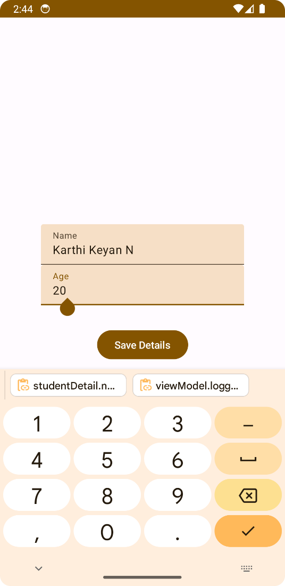
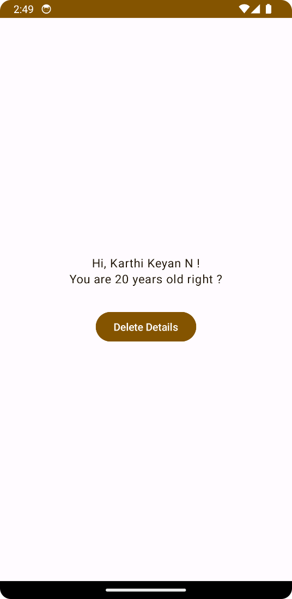

# DataStore-Android-Jetpack 🎉📱

Welcome to the repository for the DataStore Android application built using Jetpack Compose! This app is a simple data storage application that demonstrates the use of DataStore in Jetpack Compose. It's a fun and interactive way to explore the capabilities of Jetpack Compose. 😄🚀

## Features 🎯

- Simple and intuitive UI built with Jetpack Compose
- Demonstrates the use of DataStore for storing user data
- Uses ViewModel to manage UI-related data in a lifecycle conscious way
- Navigation component used for navigating between different screens
- CoroutineScope used for handling asynchronous tasks
- Data binding with `remember` and `mutableStateOf` for a reactive UI
- The app uses `NavController` for navigating between different screens based on the login status
- The `DetailStorage` class is used for storing and retrieving user details using DataStore
- The `FormPage` composable function is used for taking user input and storing it using DataStore
- The `Dashboard` composable function is used for displaying the stored user details

## Screenshots 📸

  

## How to run 🏃‍♂️

- Clone this repository using `git clone https://github.com/KarthiDreamr/DataStore-Android-Jetpack.git`
- Open the project in Android Studio Arctic Fox or later
- Run the app on an emulator or a physical device

## License 📝

This project is licensed under the GNU General Public License (GPL-3.0). The GPL is a strong copyleft license that requires improvements to be shared back with the community. For more information, see the [LICENSE](LICENSE) file.
